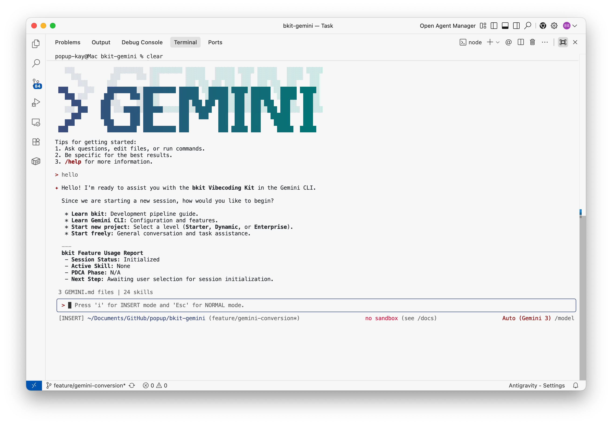

# bkit - Vibecoding Kit (Gemini CLI Edition)

[](https://opensource.org/licenses/Apache-2.0)
[](https://github.com/google-gemini/gemini-cli)
[](CHANGELOG.md)
[](https://popupstudio.ai)

> **PDCA methodology + Context Engineering for AI-native development**

bkit is a [Gemini CLI](https://github.com/google-gemini/gemini-cli) extension that transforms how you build software with AI. It provides structured development workflows, automatic documentation, and intelligent code assistance through the PDCA (Plan-Do-Check-Act) methodology and Context Engineering architecture.


*Smart onboarding detects your project level and guides you through setup*

---

## What is Context Engineering?

**Context Engineering** is the systematic curation of context tokens for optimal LLM inference -- going beyond simple prompt crafting to build entire systems that consistently guide AI behavior.

```
Traditional Prompt Engineering:
  "The art of writing good prompts"

Context Engineering:
  "The art of designing systems that integrate prompts, tools, and state
   to provide LLMs with optimal context for inference"
```

**bkit is a practical implementation of Context Engineering**, providing a systematic context management system for Gemini CLI through three interconnected layers.

---

## Architecture

### Context Engineering Layers

| Layer | Components | Count | Purpose |
|-------|-----------|-------|---------|
| **Domain Knowledge** | Skills | 29 | Structured expert knowledge activated on-demand via progressive disclosure |
| **Behavioral Rules** | Agents | 16 | Role-based constraints with model, tools, temperature configuration |
| **State Management** | Hook Scripts + Lib Modules | 17 + 6 | PDCA status tracking, intent detection, permission control, memory persistence |

### 10-Event Hook System

bkit intercepts Gemini CLI's full lifecycle through 10 hook events, enabling comprehensive automation without modifying the CLI source:

```
Event 1:  SessionStart         -> Initialize session, detect project level, load output style
Event 2:  BeforeAgent          -> Intent detection, 8-language trigger matching, ambiguity scoring
Event 3:  BeforeModel          -> PDCA phase-specific prompt augmentation
Event 4:  AfterModel           -> Response tracking, usage metrics
Event 5:  BeforeToolSelection  -> Phase-based tool filtering (plan -> readOnly, do -> all)
Event 6:  BeforeTool           -> Permission manager, dangerous command blocking (exit code 2)
Event 7:  AfterTool            -> PDCA phase auto-transition (design -> do on source write)
Event 8:  AfterAgent           -> Cleanup, phase completion detection
Event 9:  PreCompress          -> Context fork snapshot preservation before compression
Event 10: SessionEnd           -> Session cleanup, memory persistence
```

### Extension Component Map

```
bkit-gemini/
|-- gemini-extension.json         # Extension manifest (v1.5.5)
|-- GEMINI.md                     # Global context with 6 @import modules
|-- bkit.config.json              # Centralized configuration (12 sections)
|-- CHANGELOG.md                  # Version history
|
|-- .gemini/context/              # @import context modules
|   |-- pdca-rules.md             # PDCA enforcement rules
|   |-- commands.md               # Command reference
|   |-- agent-triggers.md         # Agent activation triggers
|   |-- skill-triggers.md         # Skill activation triggers
|   |-- tool-reference.md         # Tool name mapping
|   +-- feature-report.md         # Feature usage report format
|
|-- agents/                       # 16 specialized AI agents
|   |-- cto-lead.md               # CTO-level orchestration
|   |-- frontend-architect.md     # UI/UX architecture
|   |-- security-architect.md     # Security & vulnerability analysis
|   |-- product-manager.md        # Requirements & prioritization
|   |-- qa-strategist.md          # Test strategy coordination
|   |-- gap-detector.md           # Design-implementation gap analysis
|   |-- pdca-iterator.md          # Evaluator-Optimizer iteration
|   |-- code-analyzer.md          # Code quality analysis
|   |-- report-generator.md       # PDCA completion reports
|   |-- design-validator.md       # Design document validation
|   |-- qa-monitor.md             # Docker log monitoring
|   |-- starter-guide.md          # Beginner guidance
|   |-- pipeline-guide.md         # Pipeline guidance
|   |-- bkend-expert.md           # bkend.ai BaaS expertise
|   |-- enterprise-expert.md      # Enterprise architecture
|   +-- infra-architect.md        # AWS/K8s/Terraform
|
|-- skills/                       # 29 domain skills (progressive disclosure)
|   |-- pdca/SKILL.md             # Unified PDCA management (8 actions)
|   |-- starter/SKILL.md          # Static web development
|   |-- dynamic/SKILL.md          # Fullstack with BaaS
|   |-- enterprise/SKILL.md       # Microservices architecture
|   |-- development-pipeline/     # 9-phase pipeline
|   |-- code-review/              # Code review
|   |-- zero-script-qa/           # Log-based testing
|   |-- mobile-app/               # React Native, Flutter, Expo
|   |-- desktop-app/              # Electron, Tauri
|   |-- bkit-templates/           # PDCA document templates
|   |-- bkit-rules/               # Core rules
|   |-- gemini-cli-learning/      # Gemini CLI mastery
|   |-- phase-{1..9}-*/           # 9 pipeline phase skills
|   |-- bkend-quickstart/         # bkend.ai platform onboarding
|   |-- bkend-auth/               # bkend.ai authentication
|   |-- bkend-data/               # bkend.ai database CRUD
|   |-- bkend-storage/            # bkend.ai file storage
|   |-- bkend-mcp/                # bkend.ai MCP tools & AI integration
|   |-- bkend-security/           # bkend.ai security policies
|   |-- bkend-cookbook/            # bkend.ai project tutorials
|   +-- bkend-guides/             # bkend.ai operational guides
|
|-- commands/                     # 18 TOML custom commands
|   |-- bkit.toml                 # /bkit help
|   |-- pdca.toml                 # /pdca (plan, design, do, analyze, iterate, report, status, next)
|   |-- review.toml               # /review
|   |-- qa.toml                   # /qa
|   |-- starter.toml              # /starter
|   |-- dynamic.toml              # /dynamic
|   |-- enterprise.toml           # /enterprise
|   |-- pipeline.toml             # /pipeline
|   |-- learn.toml                # /learn
|   |-- github-stats.toml         # /github-stats
|   |-- bkend-quickstart.toml     # /bkend-quickstart
|   |-- bkend-auth.toml           # /bkend-auth
|   |-- bkend-data.toml           # /bkend-data
|   |-- bkend-storage.toml        # /bkend-storage
|   |-- bkend-mcp.toml            # /bkend-mcp
|   |-- bkend-security.toml       # /bkend-security
|   |-- bkend-cookbook.toml        # /bkend-cookbook
|   +-- bkend-guides.toml         # /bkend-guides
|
|-- hooks/
|   |-- hooks.json                # 10 hook event registrations
|   +-- scripts/                  # 17 hook scripts
|       |-- session-start.js      # Dynamic context injection (392 lines)
|       |-- before-agent.js       # Intent detection (186 lines)
|       |-- before-model.js       # Prompt augmentation (131 lines)
|       |-- after-model.js        # Response tracking
|       |-- before-tool-selection.js  # Tool filtering (158 lines)
|       |-- before-tool.js        # Permission + PDCA (188 lines)
|       |-- after-tool.js         # Phase transition (142 lines)
|       |-- after-agent.js        # Cleanup
|       |-- pre-compress.js       # Context preservation
|       |-- session-end.js        # Session cleanup
|       |-- skills/               # 5 per-skill post-processor hooks
|       +-- utils/                # 2 utility modules
|
|-- output-styles/                # 4 output styles
|   |-- bkit-learning.md          # Beginner-friendly explanations
|   |-- bkit-pdca-guide.md        # PDCA workflow guidance
|   |-- bkit-enterprise.md        # Enterprise-level technical
|   +-- bkit-pdca-enterprise.md   # Enterprise PDCA combined
|
|-- lib/
|   |-- skill-orchestrator.js     # Custom YAML parser, agent delegation (708 lines)
|   |-- context-hierarchy.js      # 4-level config merge (209 lines)
|   |-- core/
|   |   |-- agent-memory.js       # Per-agent persistence (214 lines)
|   |   +-- permission.js         # Glob pattern permission engine (381 lines)
|   +-- adapters/gemini/
|       |-- index.js              # Platform adapter with TOOL_MAP
|       |-- tool-registry.js      # Centralized tool name registry (v0.29.0+ verified)
|       |-- context-fork.js       # Snapshot isolation, LRU(10) (477 lines)
|       +-- import-resolver.js    # @import resolution (118 lines)
|
+-- mcp/
    +-- spawn-agent-server.js     # 6 MCP tools (753 lines)
```

---

## Features

### v1.5.5 Highlights

- **Gemini 3 Model Migration** -- All 16 agents updated to `gemini-3-pro` (9) and `gemini-3-flash` (7)
- **Version Detector** -- 3-strategy Gemini CLI version detection with feature flags and caching
- **Policy Engine Migrator** -- Auto-converts bkit permissions to v0.30.0 TOML policy format
- **Forward Alias Layer** -- Pre-mapped future tool name changes for seamless CLI upgrades
- **v0.30.0 Forward Compatibility** -- Policy Engine support with auto-generate and fallback

### v1.5.3 Highlights

- **Gemini CLI v0.29.0+ Compatibility** -- All tool names verified from source code (Issue #5 fix)
- **Tool Registry Module** -- Centralized tool name management for future-proof maintenance
- **17 Built-in Tools Mapped** -- Including new Plan Mode tools (enter_plan_mode, exit_plan_mode)
- **v0.30.0 Readiness** -- Policy Engine detection layer for smooth migration

### v1.5.2 Highlights

- **8 bkend.ai Domain Skills** -- quickstart, auth, data, storage, mcp, security, cookbook, guides
- **8 bkend.ai Commands** -- TOML commands for each bkend domain skill
- **bkend-expert Agent Rewrite** -- Complete rewrite with 28 MCP tools, bkendFetch pattern, 15 troubleshooting entries
- **16 Specialized Agents** with Gemini native frontmatter (model, tools, temperature, max_turns, timeout_mins)
- **29 Domain Skills** with progressive disclosure to save context tokens
- **10-Event Hook System** covering the full Gemini CLI lifecycle
- **PDCA Methodology** with automatic phase transitions and enforcement
- **Context Engineering** with 3-layer architecture (Domain Knowledge, Behavioral Rules, State Management)
- **8-Language Support** -- EN, KO, JA, ZH, ES, FR, DE, IT with auto-detection
- **4 Output Styles** -- bkit-learning, bkit-pdca-guide, bkit-enterprise, bkit-pdca-enterprise
- **Agent Memory** -- Per-agent persistent storage across sessions (project/user scope)
- **Team Mode Foundation** -- 3 MCP tools for agent team coordination
- **Skill Orchestrator** -- Custom YAML parser, agent delegation, template auto-loading
- **Context Hierarchy** -- 4-level config merge (Plugin -> User -> Project -> Session)
- **Permission Manager** -- Glob pattern matching with PDCA phase restrictions
- **9-Stage Development Pipeline** -- From schema design to deployment
- **3 Project Levels** -- Starter (static), Dynamic (fullstack), Enterprise (microservices)
- **@import Modularization** -- GEMINI.md split into 6 focused context modules
- **Evaluator-Optimizer Pattern** -- Automatic iteration from Anthropic's agent architecture

---

## Quick Start

> **Note**: bkit-gemini is designed for **Gemini CLI**. For Claude Code, see [bkit-claude-code](https://github.com/popup-studio-ai/bkit-claude-code).

### Prerequisites

- [Gemini CLI](https://github.com/google-gemini/gemini-cli) v0.29.0 or later
- [Git](https://git-scm.com/) installed on your machine

### Installation

#### Option 1: CLI Install (Recommended)

```bash
gemini extensions install https://github.com/popup-studio-ai/bkit-gemini.git
```

#### Option 2: Manual Install

```bash
git clone https://github.com/popup-studio-ai/bkit-gemini.git ~/.gemini/extensions/bkit
```

### Verify Installation

```bash
# In interactive mode
/extensions list

# Or in non-interactive mode
gemini extensions list

# View bkit help
/bkit
```

### Hooks Configuration

Hooks are **enabled by default** in Gemini CLI v0.29.0+. If you need to manually configure:

```json
// ~/.gemini/settings.json
{
  "hooksConfig": {
    "enabled": true
  }
}
```

> **Note:** Do NOT use `"tools": { "enableHooks": true }` -- this is incorrect syntax.

### Extension Settings

bkit provides user-configurable settings accessible via Gemini CLI's settings dialog:

| Setting | Environment Variable | Description |
|---------|---------------------|-------------|
| Output Style | `BKIT_OUTPUT_STYLE` | Response formatting (bkit-learning, bkit-pdca-guide, bkit-enterprise, bkit-pdca-enterprise) |
| Project Level | `BKIT_PROJECT_LEVEL` | Override auto-detected level (Starter, Dynamic, Enterprise) |

---

## Usage

### /bkit Command Reference

Run `/bkit` at any time to see all available commands and capabilities.

### PDCA Workflow

```bash
/pdca plan <feature>     # Create plan document
/pdca design <feature>   # Create design document
/pdca do <feature>       # Implementation guide
/pdca analyze <feature>  # Run gap analysis (delegates to gap-detector agent)
/pdca iterate <feature>  # Auto-improvement (delegates to pdca-iterator agent)
/pdca report <feature>   # Generate completion report (delegates to report-generator)
/pdca status             # Check current PDCA status
/pdca next               # Guide to next PDCA step
```

### Project Initialization

```bash
/starter init <name>     # Static website (Starter level)
/dynamic init <name>     # Fullstack with BaaS (Dynamic level)
/enterprise init <name>  # Microservices with K8s (Enterprise level)
```

### Development Pipeline

```bash
/pipeline start          # Start 9-phase pipeline
/pipeline next           # Advance to next phase
/pipeline status         # Show current phase
```

### Quality Management

```bash
/review <path>           # Code review with code-analyzer agent
/qa                      # Zero Script QA via Docker log monitoring
```

### Output Styles

```bash
/output-style            # Change response formatting style
/output-style-setup      # Install output style files
```

### Learning

```bash
/learn                   # Gemini CLI configuration learning
/learn setup             # Analyze and optimize current project setup
```

---

## User Experience

### Smart Onboarding

When you start a session, bkit automatically:
1. **Detects project level** -- scans for `kubernetes/` (Enterprise), `docker-compose.yml` (Dynamic), or defaults to Starter
2. **Loads appropriate output style** -- Starter gets beginner-friendly, Enterprise gets technical
3. **Detects returning users** -- shows feature history and recent PDCA progress
4. **Generates dynamic context** -- injects PDCA rules, agent triggers, and feature reports

### 8-Language Auto-Detection

bkit recognizes natural language triggers in 8 languages and automatically activates the appropriate agent or skill:

| Language | Example Triggers |
|----------|-----------------|
| English | "verify implementation", "analyze code", "create report" |
| Korean | "검증해줘", "분석해줘", "보고서 작성" |
| Japanese | "確認して", "分析して", "レポート作成" |
| Chinese | "验证", "分析代码", "生成报告" |
| Spanish | "verificar", "analizar", "crear informe" |
| French | "verifier", "analyser", "creer rapport" |
| German | "prufen", "analysieren", "Bericht erstellen" |
| Italian | "verificare", "analizzare", "creare rapporto" |

### Agent Memory Persistence

All 16 agents remember context across sessions automatically:
- **Project scope** (default): Memory stored in `.gemini/agent-memory/bkit/` -- shared across team
- **User scope** (starter-guide, pipeline-guide): Memory stored in `~/.gemini/agent-memory/bkit/` -- personal
- Maximum 20 sessions retained per agent

### Output Styles

| Style | Best For | Description |
|-------|----------|-------------|
| `bkit-learning` | Beginners | Step-by-step explanations with context |
| `bkit-pdca-guide` | Standard development | PDCA workflow guidance with document templates |
| `bkit-enterprise` | Enterprise teams | Technical architecture focus |
| `bkit-pdca-enterprise` | Enterprise PDCA | Combined enterprise and PDCA methodologies |

### Team Mode Foundation

bkit v1.5.5 includes team mode foundation with 3 MCP tools:
- `team_create` -- Create agent teams with configurable strategies
- `team_assign` -- Assign tasks to team members
- `team_status` -- Monitor team progress

Team strategies: dynamic (3 agents), enterprise (5 agents), custom (up to 10 agents).

---

## Project Levels

| Level | Description | Stack | Auto-Detection |
|-------|-------------|-------|----------------|
| **Starter** | Static websites, portfolios | HTML, CSS, JS | Default (no special files) |
| **Dynamic** | Fullstack applications | Next.js, BaaS | `docker-compose.yml`, `.mcp.json` |
| **Enterprise** | Microservices architecture | K8s, Terraform, MSA | `kubernetes/`, `terraform/` directories |

---

## Agents (16)

| Agent | Category | Description |
|-------|----------|-------------|
| **cto-lead** | Leadership | CTO-level orchestration, PDCA workflow management |
| **frontend-architect** | Architecture | UI/UX design, component structure, Design System |
| **security-architect** | Architecture | Vulnerability analysis, OWASP Top 10 compliance |
| **product-manager** | Management | Requirements analysis, feature prioritization, user stories |
| **qa-strategist** | Quality | Test strategy, quality metrics, verification coordination |
| **gap-detector** | PDCA Check | Design-implementation gap analysis |
| **pdca-iterator** | PDCA Act | Evaluator-Optimizer pattern, auto-fix iteration |
| **code-analyzer** | Quality | Code quality, security scan, architecture compliance |
| **report-generator** | PDCA Act | PDCA completion report generation |
| **design-validator** | PDCA Design | Design document completeness validation |
| **qa-monitor** | Quality | Docker log monitoring, Zero Script QA execution |
| **starter-guide** | Onboarding | Beginner-friendly step-by-step guidance |
| **pipeline-guide** | Pipeline | 9-phase development pipeline navigation |
| **bkend-expert** | Backend | bkend.ai BaaS platform expertise |
| **enterprise-expert** | Architecture | Enterprise-grade system strategy, microservices |
| **infra-architect** | Infrastructure | AWS, Kubernetes, Terraform infrastructure design |

Each agent uses Gemini native frontmatter with configurable `model`, `tools`, `temperature`, `max_turns`, and `timeout_mins`.

---

## Skills (29)

| Skill | Category | Trigger Examples |
|-------|----------|-----------------|
| **pdca** | Core | `/pdca plan`, `/pdca design`, `/pdca analyze` |
| **starter** | Level | "static site", "portfolio", "beginner" |
| **dynamic** | Level | "login", "fullstack", "authentication" |
| **enterprise** | Level | "microservices", "k8s", "terraform" |
| **development-pipeline** | Pipeline | "where to start", "development order" |
| **code-review** | Quality | "review code", "check quality" |
| **zero-script-qa** | Quality | "test logs", "QA without scripts" |
| **mobile-app** | Platform | "React Native", "Flutter", "iOS app" |
| **desktop-app** | Platform | "Electron", "Tauri", "desktop app" |
| **bkit-templates** | Utility | "plan template", "design template" |
| **bkit-rules** | Utility | Core rules (auto-applied) |
| **gemini-cli-learning** | Learning | `/learn`, "Gemini CLI setup" |
| **phase-1-schema** | Pipeline | "schema", "data model" |
| **phase-2-convention** | Pipeline | "coding rules", "conventions" |
| **phase-3-mockup** | Pipeline | "mockup", "wireframe", "prototype" |
| **phase-4-api** | Pipeline | "API design", "REST endpoints" |
| **phase-5-design-system** | Pipeline | "design system", "component library" |
| **phase-6-ui-integration** | Pipeline | "frontend integration", "API client" |
| **phase-7-seo-security** | Pipeline | "SEO", "security hardening" |
| **phase-8-review** | Pipeline | "architecture review", "gap analysis" |
| **phase-9-deployment** | Pipeline | "CI/CD", "production deployment" |
| **bkend-quickstart** | bkend.ai | "bkend setup", "first project", "MCP connect" |
| **bkend-auth** | bkend.ai | "signup", "login", "JWT", "session" |
| **bkend-data** | bkend.ai | "table", "CRUD", "schema", "filter" |
| **bkend-storage** | bkend.ai | "file upload", "presigned URL", "CDN" |
| **bkend-mcp** | bkend.ai | "MCP tools", "AI integration", "28 tools" |
| **bkend-security** | bkend.ai | "RLS", "API keys", "encryption" |
| **bkend-cookbook** | bkend.ai | "tutorial", "example project", "todo app" |
| **bkend-guides** | bkend.ai | "troubleshooting", "migration", "environment" |

Skills use progressive disclosure -- only metadata is loaded initially, with full instructions injected when activated.

---

## TOML Commands (18)

bkit provides 18 custom commands using Gemini CLI's TOML command format with advanced syntax:

| Command | Description | Syntax Features |
|---------|-------------|-----------------|
| `/bkit` | Show help and available functions | Static prompt |
| `/pdca <action>` | PDCA cycle management | `@{path}` file inclusion, `!{command}` shell exec, `{{args}}` interpolation |
| `/review <path>` | Code review | `@{path}` skill loading |
| `/qa` | Zero Script QA | `@{path}` skill loading |
| `/starter <action>` | Starter project commands | `@{path}` + `{{args}}` |
| `/dynamic <action>` | Dynamic project commands | `@{path}` + `{{args}}` |
| `/enterprise <action>` | Enterprise project commands | `@{path}` + `{{args}}` |
| `/pipeline <action>` | Development pipeline | `@{path}` + `{{args}}` |
| `/learn [topic]` | Gemini CLI learning | `@{path}` + `!{command}` + `{{args}}` |
| `/github-stats` | GitHub repository statistics | Custom prompt |
| `/bkend-quickstart` | bkend.ai platform onboarding | `@{path}` + `{{args}}` |
| `/bkend-auth` | bkend.ai authentication guide | `@{path}` + `{{args}}` |
| `/bkend-data` | bkend.ai database operations | `@{path}` + `{{args}}` |
| `/bkend-storage` | bkend.ai file storage guide | `@{path}` + `{{args}}` |
| `/bkend-mcp` | bkend.ai MCP tools & AI | `@{path}` + `{{args}}` |
| `/bkend-security` | bkend.ai security policies | `@{path}` + `{{args}}` |
| `/bkend-cookbook` | bkend.ai project tutorials | `@{path}` + `{{args}}` |
| `/bkend-guides` | bkend.ai operational guides | `@{path}` + `{{args}}` |

### TOML Advanced Syntax

```toml
# Example: pdca.toml
description = "PDCA cycle management"
prompt = """
@skills/pdca/SKILL.md           # @{path} - Include file content
Execute PDCA action: {{args}}    # {{args}} - User argument interpolation
Current status:
!cat docs/.pdca-status.json      # !{command} - Shell command execution
"""
```

---

## Tool Name Mapping

bkit uses Gemini CLI native tool names (v0.29.0+ verified from source):

| Claude Code Tool | Gemini CLI Tool |
|------------------|-----------------|
| Write | write_file |
| Edit | replace |
| Read | read_file |
| Bash | run_shell_command |
| Glob | glob |
| Grep | grep_search |
| WebSearch | google_web_search |
| WebFetch | web_fetch |
| AskUserQuestion | ask_user |
| Skill | activate_skill |
| TodoWrite | write_todos |
| SaveMemory | save_memory |
| EnterPlanMode | enter_plan_mode |
| ExitPlanMode | exit_plan_mode |

---

## Language Support

bkit automatically detects your language from trigger keywords in 8 languages:

| Language | Trigger Keywords |
|----------|-----------------|
| English | static website, beginner, API design, verify, analyze |
| Korean | 정적 웹, 초보자, API 설계, 검증, 분석 |
| Japanese | 静的サイト, 初心者, API設計, 確認, 分析 |
| Chinese | 静态网站, 初学者, API设计, 验证, 分析 |
| Spanish | sitio web estatico, principiante, verificar |
| French | site web statique, debutant, verifier |
| German | statische Webseite, Anfanger, prufen |
| Italian | sito web statico, principiante, verificare |

---

## Updating bkit Extension

### Via CLI (Recommended)

```bash
gemini extensions install https://github.com/popup-studio-ai/bkit-gemini.git
```

This reinstalls the extension with the latest version from the repository.

### Manual Update

```bash
cd ~/.gemini/extensions/bkit && git pull origin main
```

### Verify Update

```bash
# Check extension list
/extensions list

# Verify version
/bkit
```

### Development Mode

For local development, use the `link` command to avoid reinstalling after every change:

```bash
gemini extensions link /path/to/local/bkit-gemini
```

In Gemini CLI v0.28.2+, you can use the following command to refresh agents and skills without restarting:

```bash
/agents refresh
```

---

## Security & Permissions (v0.28.2+)

Gemini CLI v0.28.2 introduces strict security warnings for extensions using hooks. When installing or activating `bkit`, you may see warnings about tool interception.

**Why bkit uses hooks:**
- **PDCA Context**: To automatically track development phases and update `.pdca-status.json`.
- **Memory Management**: To persist agent-specific context across sessions.
- **Intent Detection**: To intelligently trigger the right agents based on your prompt.

These hooks are non-interactive, performance-optimized, and essential for the Context Engineering features of bkit.

---

## Compatibility

| Requirement | Version |
|-------------|---------|
| Gemini CLI | v0.29.0+ (forward-compatible with v0.30.0 Policy Engine) |
| Node.js | v18+ (for hook scripts) |
| Git | Any recent version |

### Gemini CLI Feature Utilization

| Gemini CLI Feature | bkit Usage |
|-------------------|-----------|
| Agent frontmatter (model, tools, temperature, max_turns, timeout_mins) | All 16 agents |
| 10 Hook Events | All 10 events registered with matcher patterns |
| @import syntax | 6 context modules in `.gemini/context/` |
| TOML commands with `@{}`, `!{}`, `{{}}` | 18 enhanced commands |
| Agent Skills (GA since v0.26.0) | 29 skills with progressive disclosure |
| MCP servers | 6 tools via `spawn-agent-server.js` |
| Extension manifest `settings` | 2 user-configurable options |
| `${extensionPath}` variable | Used in hooks.json for portable paths |

---

## Documentation

### Component Reference

- [Development Pipeline](skills/development-pipeline/SKILL.md) -- 9-stage pipeline skill
- [Skills Reference](skills/) -- 29 domain skills
- [Agents Reference](agents/) -- 16 specialized agents
- [Changelog](CHANGELOG.md) -- Complete version history

### PDCA Documents

- [Plans](docs/01-plan/features/) -- Feature plan documents
- [Designs](docs/02-design/features/) -- Feature design documents
- [Reports](docs/04-report/) -- PDCA completion reports

---

## Relationship to bkit-claude-code

bkit-gemini is a fork of [bkit-claude-code](https://github.com/popup-studio-ai/bkit-claude-code), adapted for Gemini CLI compatibility. Key differences:

| Aspect | bkit-claude-code | bkit-gemini |
|--------|-----------------|-------------|
| Platform | Claude Code | Gemini CLI |
| Context file | CLAUDE.md | GEMINI.md |
| Tool names | Write, Edit, Read, Bash | write_file, replace, read_file, run_shell_command |
| Variables | N/A | `${extensionPath}`, `${workspacePath}` |
| Hooks | Claude Code hooks | Gemini CLI 10-event hook system |
| Commands | Slash commands | TOML commands with `@`, `!`, `{{}}` syntax |
| Skills | Native skills | Skills (GA since v0.26.0) |
| Agent format | .md with custom fields | .md with Gemini native frontmatter |

---

## Contributing

We welcome contributions! Please see [CONTRIBUTING.md](CONTRIBUTING.md) for guidelines.

### Branch Protection

- Only `admin` team members can merge to `main`
- All changes require pull request review
- Version releases are managed through Git tags

---

## License

Copyright 2024-2026 POPUP STUDIO PTE. LTD.

Licensed under the Apache License, Version 2.0. See [LICENSE](LICENSE) for details.

You must include the [NOTICE](NOTICE) file in any redistribution.

---

## Support

- **Issues**: [GitHub Issues](https://github.com/popup-studio-ai/bkit-gemini/issues)
- **Email**: contact@popupstudio.ai

---

Made with AI by [POPUP STUDIO](https://popupstudio.ai)
