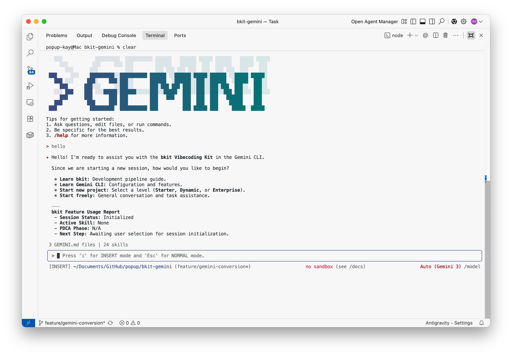

# bkit - Vibecoding Kit (Gemini CLI Edition)

> **PDCA methodology + Context Engineering for AI-native development**

bkit is a [Gemini CLI](https://github.com/google-gemini/gemini-cli) extension that transforms how you build software with AI. It provides structured development workflows, automatic documentation, and intelligent code assistance through the PDCA (Plan-Do-Check-Act) methodology and Context Engineering architecture.

*Smart onboarding detects your project level and guides you through setup*

---

## Start in 5 minutes

→ **[QUICKSTART.md](QUICKSTART.md)** — install, `bkit Hi`, first PDCA.

## Core capabilities

- **PDCA workflow** — `/pdca plan|design|implement|analyze|iterate|report`
- **Context Engineering** — 3-layer (Layered + JIT + Memory) token-efficient context
- **21 Specialized Agents + 35 Skills + 24 TOML Commands** — full catalog: [docs/reference/commands.md](docs/reference/commands.md)
- **Project Levels** — `/starter` (static), `/dynamic` (fullstack), `/enterprise` (microservices)
- **8-Language Auto-Detection** — EN / KO / JA / ZH / ES / FR / DE / IT
- **Agent Memory + Auto Memory inbox** — per-agent persistent learning across sessions
- **L0–L4 Automation Levels** — `/control level <N>` (manual ↔ full-auto with safety gates)

## Documentation

| Topic | Location |
|-------|----------|
| 5-min onboarding | [QUICKSTART.md](QUICKSTART.md) |
| Architecture (Hooks, Component Map) | [docs/reference/architecture.md](docs/reference/architecture.md) |
| Features history (v1.5.x ~ v2.0.7) | [docs/reference/features-history.md](docs/reference/features-history.md) |
| Commands (Usage / 21 Agents / 35 Skills / 24 TOML Commands) | [docs/reference/commands.md](docs/reference/commands.md) |
| Update / Development / Security | [docs/reference/troubleshooting.md](docs/reference/troubleshooting.md) |
| Release notes | [CHANGELOG.md](CHANGELOG.md) |
| Component reference | [docs/reference/](docs/reference/) |
| PDCA documents | `docs/{01-plan,02-design,03-analysis,04-report}/` |
| LLM context | [GEMINI.md](GEMINI.md) (slim 3.2KB) |

## Relationship to bkit-claude-code

bkit-gemini is the **Gemini CLI port** of bkit. Both editions share the PDCA methodology and Context Engineering layers but adapt to each CLI's hook/policy contracts. See `docs/reference/architecture.md` for cross-edition mapping.

## Compatibility

- **Gemini CLI**: ≥ v0.34.0 (tested through v0.42.0 stable)
- **Node.js**: ≥ 18
- **OS**: macOS / Linux / WSL / Git Bash (pure JS, no native bindings)

## Contributing

Branch protection on `main` requires PR review. See `docs/reference/troubleshooting.md` § Contributing.

## License

Apache 2.0 — see [LICENSE](LICENSE).

## Support

- Issues: [GitHub Issues](https://github.com/popup-studio-ai/bkit-gemini/issues)
- Discussions: [GitHub Discussions](https://github.com/popup-studio-ai/bkit-gemini/discussions)
- Maintainer: [POPUP STUDIO PTE. LTD.](https://popupstudio.ai)

---

> **Legacy anchors**: README sections from v2.0.6 (Architecture / Features / Quick Start details / Hooks Config / Usage / Project Levels / Agents / Skills / TOML Commands / Language Support / Updating / Security / Compatibility / Documentation / Relationship / Contributing) have moved to `docs/reference/*.md`. Deep-links into the old anchor names are noted at the top of each reference file.
